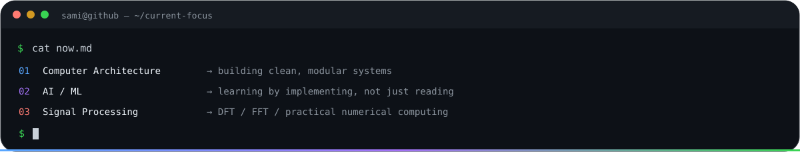

<p align="center">
  
</p>

<p align="center">
  <a href="https://github.com/shamsulhaquesami01"></a>
  <a href="https://www.linkedin.com/in/shamsul-haque-sami-a50678308/"></a>
  <a href="mailto:shamsulhaquesami@gmail.com"></a>
  
</p>

## `// identity`

<table>
<tr>
<td width="58%" valign="top">

### Md. Shamsul Haque Sami

**CSE @ BUET · Level 2, Term 2**

I enjoy building software that sits close to the fundamentals: algorithms, systems, architecture, databases, signal processing, and intelligent applications. My favorite projects are the ones where the implementation becomes cleaner than the original idea.

- **Current direction:** Computer Architecture, AI/ML, Signal Processing
- **Working style:** understand → model → implement → test → polish
- **Bias:** useful over flashy, but useful can still look excellent

</td>
<td width="42%" valign="top">

```text
STATUS
──────
Role      student + builder
Location  BUET / CSE
Mode      learning by shipping
Signal    █████████░ 90%
Focus     systems × intelligence
```

</td>
</tr>
</table>

## `// now`

<p align="center">
  
</p>

## `// toolkit`

<p align="center">
  
</p>

<p align="center">
  <code>#0D1117</code> base · <code>#161B22</code> surface · <code>#30363D</code> border · <code>#58A6FF</code> blue · <code>#A371F7</code> violet · <code>#39D353</code> green
</p>

## `// selected work`

<table>
<tr>
<td width="50%" valign="top">

### 🎮 [102 Game Project](https://github.com/shamsulhaquesami01/102-Game-Project)

A C++ game project from Level 1 Term 1 built around object-oriented design, graphics, and actual gameplay polish.

`C++` `OOP` `Graphics` `Game Logic`

</td>
<td width="50%" valign="top">

### 🛒 [CHALDAAL](https://github.com/shamsulhaquesami01/CHALDAAL)

A database-course delivery application with a real frontend/backend structure, SQL integration, and authentication-oriented flows.

`Database` `SQL` `Web` `Application Design`

</td>
</tr>
<tr>
<td width="50%" valign="top">

### 🧮 [Smart Grade Calc](https://github.com/shamsulhaquesami01/Smart-Grade-Calc)

A focused utility project for turning academic grading logic into something fast and convenient to use.

`Utility` `Automation` `Product Thinking`

</td>
<td width="50%" valign="top">

### 🧭 [Portfolio](https://github.com/shamsulhaquesami01/portfolio)

A personal web space for presenting projects, experiments, and the evolution of my engineering work.

`Frontend` `Design` `Personal Brand`

</td>
</tr>
</table>

## `// contribution signal`

<p align="center">
  
</p>

## `// activity telemetry`

<p align="center">
  
</p>

<p align="center">
  
  
</p>

<p align="center">
  
  
</p>

## `// engineering principles`

```text
01  Make the difficult part understandable.
02  Prefer modular systems over clever tangles.
03  Use abstractions only when they remove real friction.
04  Measure before optimizing.
05  Finish the last 10% — that is where projects become products.
```

<p align="center">
  <sub>Built in GitHub dark mode · animated with pure SVG · no JavaScript required</sub>
</p>
